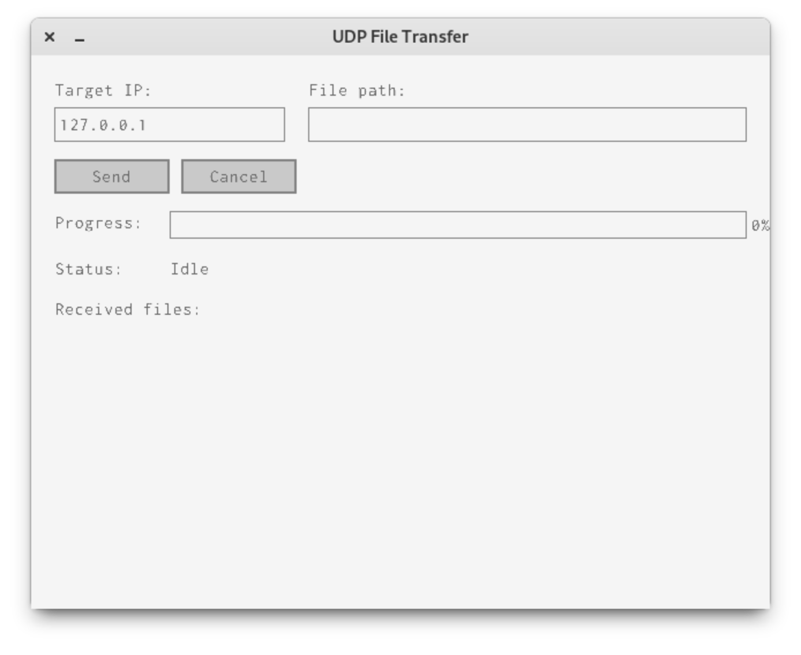

# UDP File Transfer over SSH

A raylib/raygui file transfer tool that sends UDP datagrams through an existing SSH connection, without requiring router or firewall changes.

## Dependencies

- raylib (system package or built from source)
- raygui.h in third_party/
- udp-over-tcp (https://github.com/mullvad/udp-over-tcp) installed on both machines
- OpenSSH client and server

## Build

    mkdir build && cd build
    cmake ..
    cmake --build .

## Run

On the local machine:

    ./scripts/setup_tunnel.sh user@remote-host

Then in another terminal:

    ./build/udp_transfer --receive

Enter 127.0.0.1 as the target IP and 3000 as the port (the local proxy's UDP listener). The datagrams will be tunneled through SSH to the remote machine, where they emerge as UDP on port 6000.

## Command-line arguments

The only command-line argument that this program currently supports is for which ever computer intends to receive the file to be transferred. It runs RaylibUDPTransfer in headless mode and will only receive files.

To run in headless mode, enter: `udp_transfer --receive`

## Optional Configuration
This application assumes that OpenSSH is being used as the SSHd server. An optional step to reduce potential network congestion is to enable BBR in the OpenSSH config, or just enter this at the CLI: `net.ipv4.tcp_congestion_control = bbr` or use `sysctl` to set it system wide.

## Minimal Example
To transfer a file between 2 computers, this is a minimal working example. There is also a script in the scripts/ folder that can help expedite this once a user is comfortable with the command-line example.

Remote machine, terminal 1:
`./udp_transfer --receive`

Remote machine, terminal 2:
`tcp2udp --tcp-listen 0.0.0.0:4000 --udp-forward 127.0.0.1:3000`

Local machine, terminal 1:
`ssh -N -L 5000:localhost:4000 user@remote-host`

Local machine, terminal 2:
`udp2tcp --udp-listen 127.0.0.1:3000 --tcp-forward 127.0.0.1:5000`

Local machine, terminal 3:
`./udp_transfer`